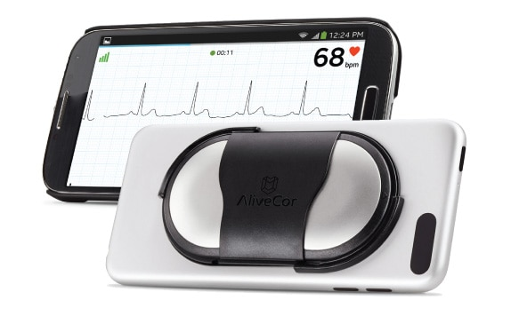
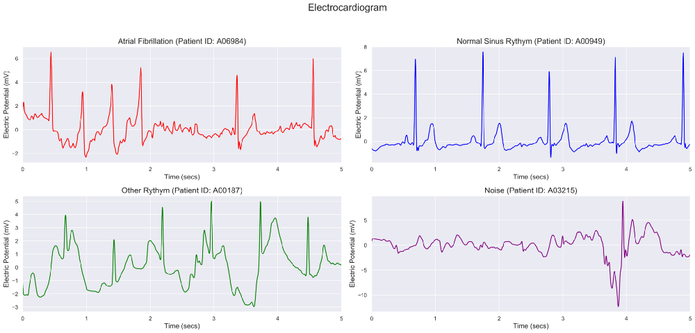
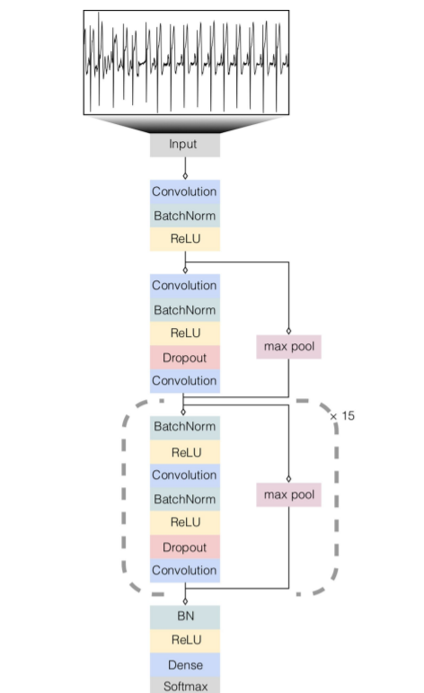

# Automatic Detection of Atrial Fibrillation in Ambulatory Electrocardiograms using a Deep Neural Network

## Objective 

The electrocardiogram is a fundamental tool in the everyday practice of clinical medicine. It is crucial for diagnosing a wide spectrum of heart abnormalities from arrhythmias to myocardial infarction. The combination of widespread digitization of ECG data and the development of algorithmic paradigms that can benefit from large-scale processing of raw data may provide substantial improvements to ECG interpretation.

Atrial fibrillation (AF) is is the most common sustained cardiac arrhythmia, occurring in 1–2% of the general population. This arrhythmia is associated with significant morbidity, carrying a 4- to 5-fold increased risk for ischemic stroke. AF is often silent, with patients occasionally presenting with stroke as the first manifestation of the arrhythmia. Other patients have troubling symptoms such as palpitations or dizziness, but traditional monitoring has been unable to define an arrhythmia. Despite the enormity of this problem, AF detection remains problematic, because it may be episodic. Therefore, periodic sampling of heart rate and rhythm could be helpful to establish a diagnosis in these conditions.

## Data
[Data](https://www.physionet.org/content/challenge-2017/1.0.0/) used in this project underwent expert annotation for 4 rhythm classes: normal sinus rhythm (N), atrial fibrillation (A), other rhythm (O), and noise (~). A total of 8528 ECG recordings, each lasting from 9s to 61s, and of variable lengths, were present in the dataset. Each ECG recording was taken by a patient and was recorded by the AliveCor ECG device, which is a Food and Drug Administration (FDA)-cleared, single-lead, ambulatory ECG monitor that continuously records data from a single vector (modified Lead I [LA-RA]) at a frequency of 300Hz, which in theory has each of the two electrodes of the ECG monitor in each hand. A good number of the ECG recordings were inverted (RA-LA) since the device did not require the patients to rotate it in any particular orientation.

## ECG Plots
ECGs of Atrial fibrillation, normal sinus rhythm, other rhythm and noise.

## Neural Network Architecture
The model was built using Keras, utilizing TensorFlow as the backend.

## Results
On evaluation, the neural network returned the following results:

| Class | Precision | Recall | Specificity | NPV | F1 |
| :-----: | :-----: | :-----: | :-----: | :-----: | :-----: |
| A | 0.662 | 0.810 | 0.967 | 0.985 | 0.729 |
| N | 0.899 | 0.818 | 0.855 | 0.748 | 0.857 |
| O | 0.653 | 0.693 | 0.852 | 0.874 | 0.672 |
| ~ | 0.317 | 0.565 | 0.966 | 0.988 | 0.406 |

## Future Updates
1. Get more data and retrain the neural network.
2. Increase the batch size to 32, 64 or 128. (The batch size of 2 used during training is probably too small.)  
